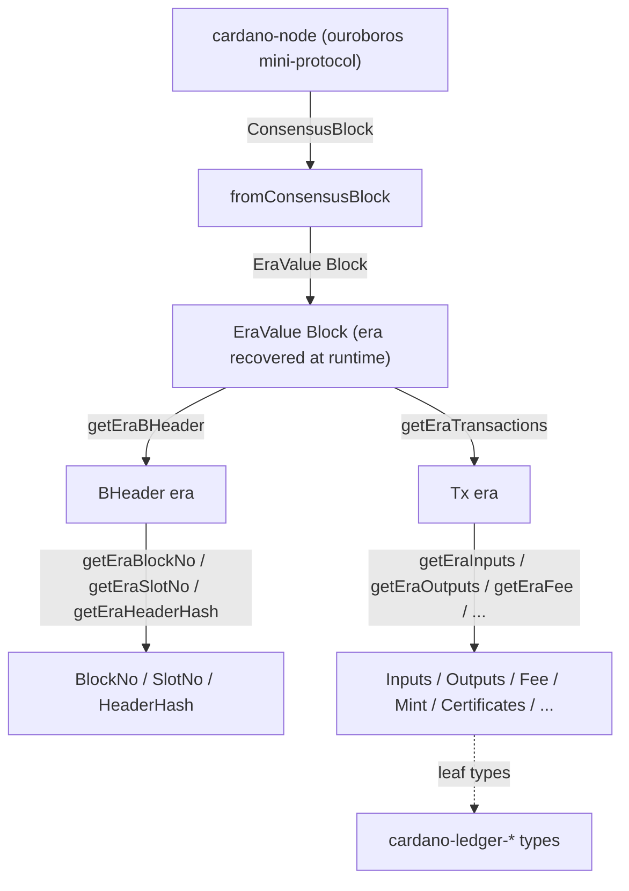

# cardano-ledger-read

[](https://github.com/cardano-foundation/cardano-ledger-read/actions/workflows/CI.yaml)
[](https://github.com/cardano-foundation/cardano-ledger-read/actions/workflows/deploy-docs.yaml)

Era-indexed Haskell types for reading Cardano blockchain data.

[Documentation](https://cardano-foundation.github.io/cardano-ledger-read/)

## What is this

`cardano-ledger-read` is a Haskell library that provides data types and
functions for reading on-chain data — blocks, transactions, and their
components (inputs, outputs, fees, certificates, metadata, …). The leaf
types are the era-specific types from the
[`cardano-ledger`](https://github.com/IntersectMBO/cardano-ledger)
packages; this library adds a uniform era index on top of them.

The library is a *read-side projection layer*: it reads and projects
on-chain data. It deliberately does **not** construct, balance, sign, or
submit transactions — that is the job of downstream packages. It is also
not complete: the surface is tailored to wallet and indexer needs.

Every type is parameterized uniformly over the Cardano era. The set of
eras is a **closed type-level list** (`KnownEras`): Byron, Shelley,
Allegra, Mary, Alonzo, Babbage, Conway, and Dijkstra. Era-polymorphic
operations dispatch on the `Era` GADT singleton, and the `EraValue`
existential wraps a value whose era is only known at runtime (for
example, a block just received from a node).

> This library is experimental and not yet production-ready.

## Architecture

A block arrives from a node as a `ConsensusBlock` (the era is not known
statically). `fromConsensusBlock` recovers the era into an
`EraValue Block`; `applyEraFun` runs an era-polymorphic accessor against
it. Within a known era, accessors project blocks, headers, and
transactions down to `cardano-ledger` leaf types.



See the [Architecture page](https://cardano-foundation.github.io/cardano-ledger-read/architecture/)
for the era model in detail.

## Install

The package is not published to Hackage or CHaP yet. Depend on it from
your own project by adding a `source-repository-package` stanza to your
`cabal.project`:

```cabal
source-repository-package
  type: git
  location: https://github.com/cardano-foundation/cardano-ledger-read
  tag: <commit-or-tag>
```

and then list it in your package's `build-depends`:

```cabal
build-depends: cardano-ledger-read
```

Because the leaf types come from `cardano-ledger`, your project must
resolve the same `cardano-ledger-*` packages from
[CHaP](https://github.com/intersectmbo/cardano-haskell-packages); see
[`cabal.project`](cabal.project) for the index-state and version
constraints this repository builds against.

## Quickstart

Clone the repository and build it inside the Nix development shell:

```bash
git clone https://github.com/cardano-foundation/cardano-ledger-read
cd cardano-ledger-read
nix develop          # haskell.nix shell with cabal, GHC 9.12, just
just build           # cabal build all --enable-tests -O0
just test            # cabal test all --enable-tests -O0
```

## Usage

The main entry point for reading a block whose era is not known
statically (for example, one received from a node) is
`fromConsensusBlock`, combined with `applyEraFun`:

```haskell
import Cardano.Read.Ledger.Block.Block (ConsensusBlock, fromConsensusBlock)
import Cardano.Read.Ledger.Block.Txs (getEraTransactions)
import Cardano.Read.Ledger.Tx.Hash (getEraTxHash)
import Cardano.Read.Ledger.Eras.EraValue (applyEraFun)
import Data.ByteString (ByteString)

-- | Number of transactions in a block, in any era.
txCount :: ConsensusBlock -> Int
txCount =
    applyEraFun (length . getEraTransactions) . fromConsensusBlock

-- | Transaction hashes of every transaction in a block, in any era.
txHashes :: ConsensusBlock -> [ByteString]
txHashes =
    applyEraFun (map getEraTxHash . getEraTransactions)
        . fromConsensusBlock
```

When the era *is* known statically, work with `Tx era` / `Block era`
directly. Decode a transaction from CBOR and read its components:

```haskell
import Cardano.Read.Ledger.Tx.CBOR (deserializeTx)
import Cardano.Read.Ledger.Tx.Tx (Tx)
import Cardano.Read.Ledger.Tx.Inputs (Inputs, getEraInputs)
import Cardano.Read.Ledger.Tx.Outputs (Outputs, getEraOutputs)
import Cardano.Read.Ledger.Tx.Fee (Fee, getEraFee)
import Cardano.Read.Ledger.Eras (Conway)
import Cardano.Ledger.Binary (DecoderError)
import qualified Data.ByteString.Lazy as BL

readConwayTx
    :: BL.ByteString
    -> Either DecoderError (Inputs Conway, Outputs Conway, Fee Conway)
readConwayTx cbor = do
    tx <- deserializeTx cbor :: Either DecoderError (Tx Conway)
    pure (getEraInputs tx, getEraOutputs tx, getEraFee tx)
```

Transaction and block components each live in a `Cardano.Read.Ledger.*`
module that exports an era-indexed wrapper type and a `getEra…`
accessor. See the [API Overview](https://cardano-foundation.github.io/cardano-ledger-read/api/)
for the full module map.

## Documentation

- Full documentation site: <https://cardano-foundation.github.io/cardano-ledger-read/>
- For AI agents, start at [AGENTS.md](AGENTS.md).

## Development

```bash
nix develop          # enter the dev shell (direnv: `use flake`)
just                 # list all recipes
just build           # build all components
just test            # run the test suite
just format          # fourmolu + nixfmt
just lint            # hlint
just ci              # format + lint + build + test
just docs            # serve the docs site locally with mkdocs
```

## License

[Apache-2.0](LICENSE).
