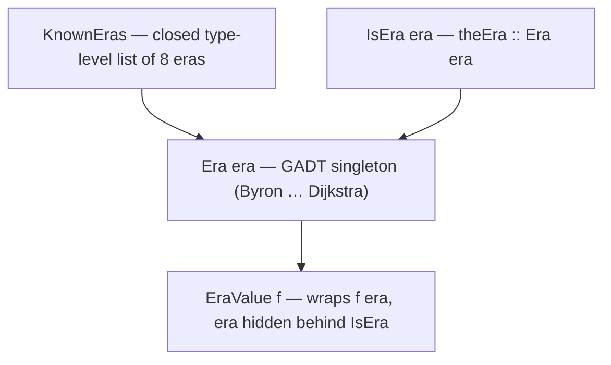
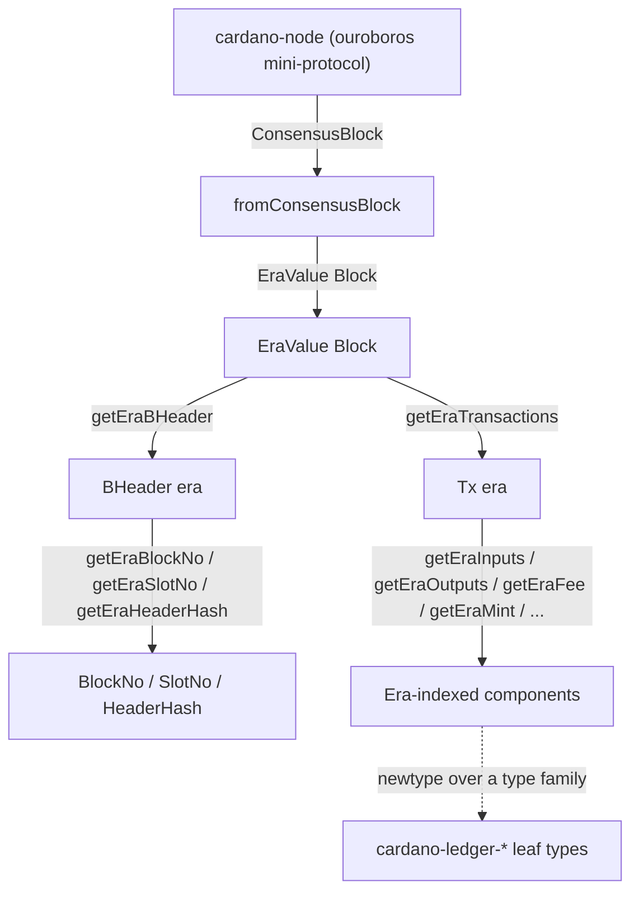

# Architecture

`cardano-ledger-read` is a thin, read-only projection layer over the
`cardano-ledger-*` packages. Its job is to give every on-chain concept
a uniform era index, so that code can read blocks and transactions
without committing to a single era at compile time.

## The era model

The set of supported eras is a **closed type-level list**, `KnownEras`,
defined once in `Cardano.Read.Ledger.Eras.KnownEras`:

| Index | Era | Type alias |
|-------|-----|------------|
| 0 | Byron | `Byron` |
| 1 | Shelley | `Shelley` |
| 2 | Allegra | `Allegra` |
| 3 | Mary | `Mary` |
| 4 | Alonzo | `Alonzo` |
| 5 | Babbage | `Babbage` |
| 6 | Conway | `Conway` |
| 7 | Dijkstra | `Dijkstra` |

Three pieces work together:

- **`KnownEras`** — the type-level list of eras, in chronological order.
- **`Era era`** — a GADT singleton with one constructor per era
  (`Byron`, `Shelley`, …, `Dijkstra`), giving a value-level handle on a
  type-level era.
- **`IsEra era`** — a class with a single method, `theEra :: Era era`,
  that reflects a type-level era down to its singleton. It exists *only*
  to bridge the type and value levels and is never extended with
  per-era methods.



Era-indexed *types* are selected by **closed type families** — one
equation per era — for example `TxT era`, `InputsType era`,
`OutputsType era`, `PParamsType era`. Era-polymorphic *operations*
dispatch by pattern matching on the `Era` singleton:

```haskell
getEraInputs :: forall era. IsEra era => Tx era -> Inputs era
getEraInputs = case theEra @era of
    Byron   -> ...
    Shelley -> ...
    -- one branch per era, no wildcard
```

Because the era list is closed, every such `case` is exhaustive without
a wildcard, and adding or removing an era is a single mechanical sweep
across the type families, the GADT, the `IsEra` instances, and the
`EraValue` traversals.

## EraValue: hiding the era at runtime

When a block arrives from a node, its era is not known statically.
`EraValue` is the existential that captures it:

```haskell
data EraValue f = forall era. IsEra era => EraValue (f era)
```

Pattern matching on `EraValue` brings `IsEra era` back into scope.
`applyEraFun` applies an era-polymorphic function to the wrapped value,
producing an era-independent result, while `applyEraFunValue` maps one
era-indexed wrapper to another. `eraValueSerialize` and `parseEraIndex`
encode and decode the era as the integer index from the table above.

## Reading pipeline

A block received from `cardano-node` (over the ouroboros mini-protocol)
is a `ConsensusBlock = CardanoBlock StandardCrypto`. The typical read
path is:



1. `fromConsensusBlock :: ConsensusBlock -> EraValue Block` recovers the
   era.
2. Inside the era (via `applyEraFun` or a known-era `Block era`),
   `getEraBHeader` and `getEraTransactions` project the header and the
   transaction list.
3. Per-transaction accessors (`getEraInputs`, `getEraOutputs`,
   `getEraFee`, `getEraMint`, `getEraCertificates`, …) project each
   component, each returning a `newtype` wrapper over the corresponding
   `cardano-ledger` type for that era.

## Design constraints

The library follows a small set of load-bearing rules (recorded in full
in `.specify/memory/constitution.md`):

- **Read-only.** No transaction construction, balancing, signing, or
  submission — those belong to downstream packages.
- **Closed-world eras.** Eras are a closed list; pattern matches over
  `Era` are exhaustive with no wildcard.
- **Type families + GADTs over typeclasses.** `IsEra` is the only class
  in the era model and never grows per-era methods.
- **Total at era boundaries.** Upgrade/projection functions are total
  over `KnownEras`, or reflect partiality in their type (`Maybe` /
  `Either`).
- **Mirror, don't redefine.** Leaf types stay as `cardano-ledger-*`
  types; the library only adds era-indexing and the `EraValue`
  existential.
- **Minimal dependency surface.** No dependency on `cardano-api`,
  `cardano-wallet-*`, `cardano-node`, or `cardano-cli`.
